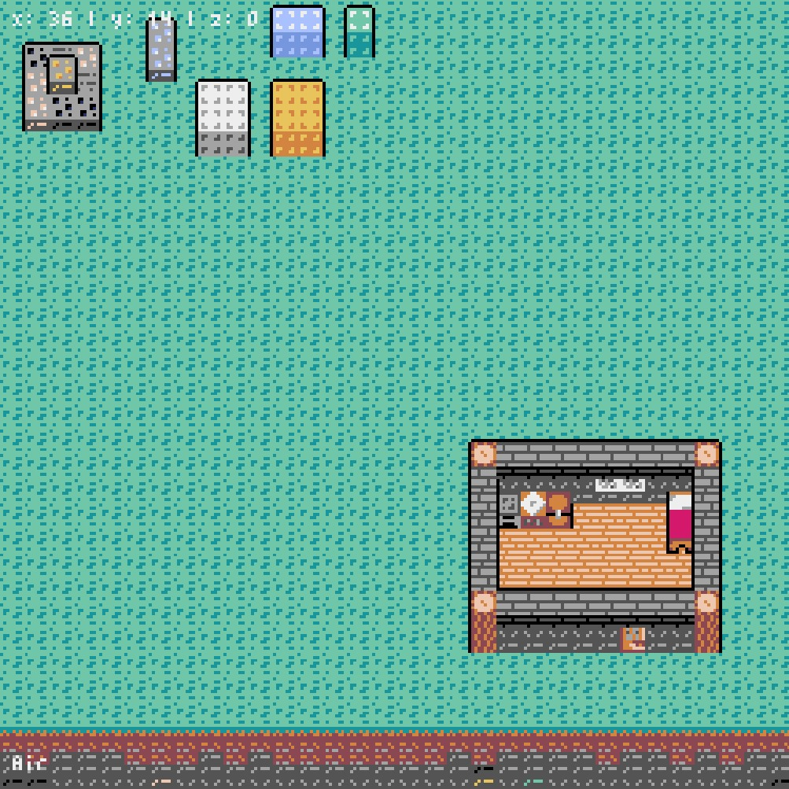
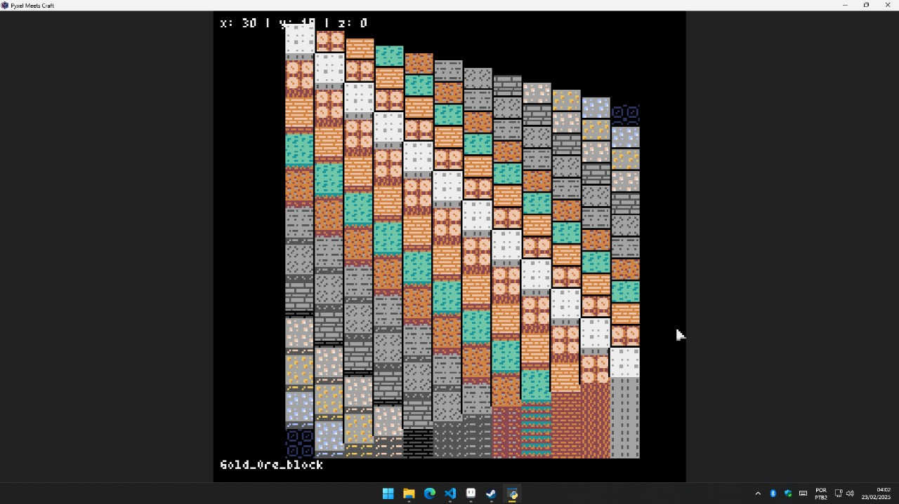

# 🧱 Pixel Meets Craft

A retro-style, fake-3D Minecraft-like game built with [Pyxel](https://github.com/kitao/pyxel), the Python engine for pixel-perfect 8-bit games. This project uses cleverly designed sloped block sprites to simulate depth and perspective in a fully 2D environment.

---

## 🎮 About the Game

**Pixel Meets Craft** is a sandbox building game inspired by Minecraft's blocky style — but reimagined in a retro pixel art world. It gives the illusion of 3D by using angled tiles and rendering tricks, creating a unique visual experience while maintaining simplicity and performance.

Everything you see is actually 2D, but built with a layered tilemap that creates a strong illusion of height, depth, and volume.

---

## 📸 Screenshots

### World Exploration

### Cozy Indoor Room

### Block Palette and Assets

---

## 🧱 Features

- ✅ Fake 3D block system using sloped sprites
- ✅ Tile-based world
- ✅ Layered block rendering (Z-depth)
- ✅ Indoor structures with furniture
- ✅ Custom pixel art assets

---

## 💡 Motivation

This project started as an experiment in using **2D rendering** to simulate **3D perspective**, inspired by isometric and voxel games. Pyxel provides a clean and nostalgic platform for building such an idea with performance in mind.

The goal is to make a lightweight Minecraft-like experience that’s accessible, easy to modify, and fun to build on.

---

## 🛠 Built With

- **Python 3**
- **Pyxel** — Retro Game Engine for Python
- **Custom pixel art assets** made manually

---
